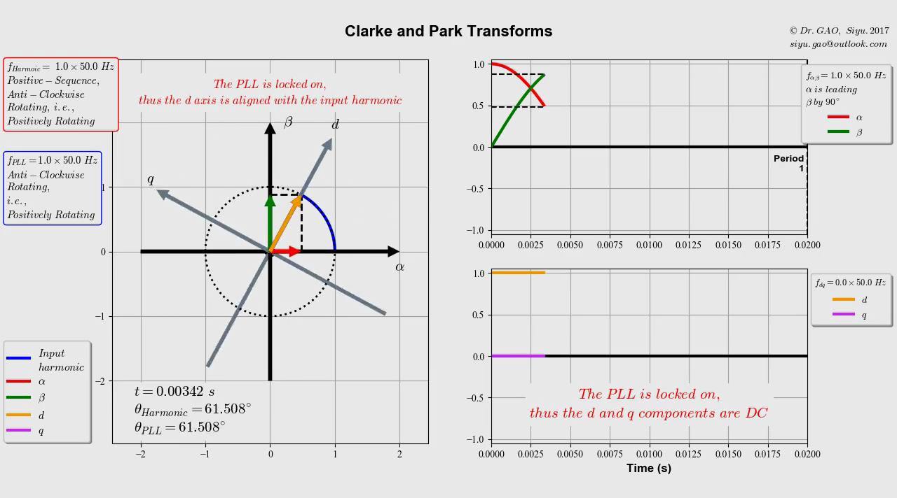
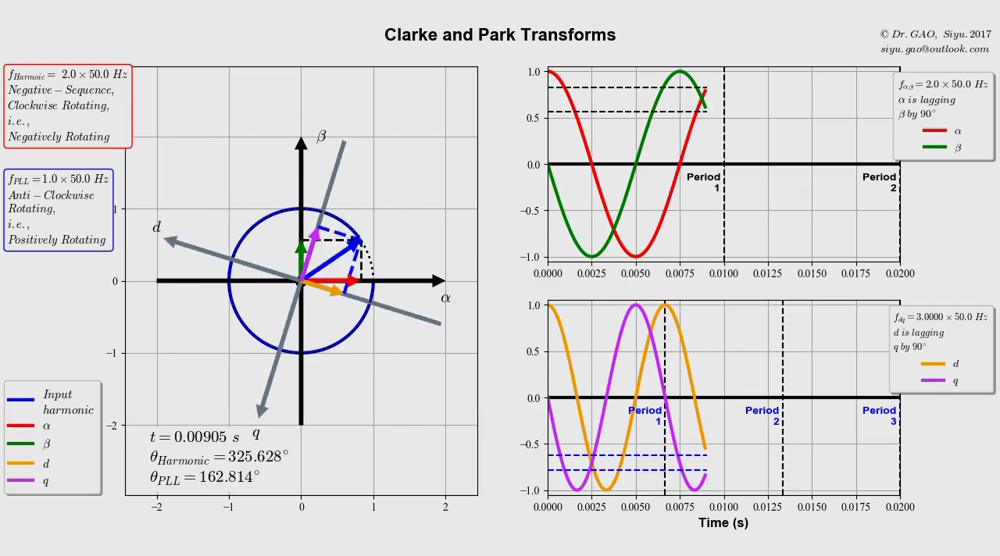
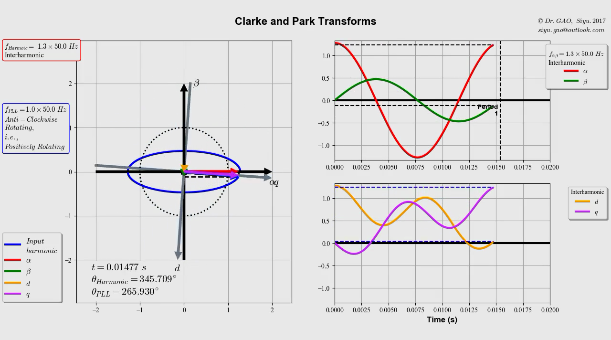

# Dynamic Visualisation for Clarke and Park Transforms

The purpose of this project is to provide an graphic based UI for the user to dynamically visualise and analyse the Clarke Transform and Park Transform for balanced three-phase inputs.

!!Warning!!

DO NOT use matplotlib 3.0.2, it causes errors. A working version is 2.3.3.

## Getting Started

Type the following in your terminal:

```python
    python gsyDqMain.py
```

This should let Python to run the main script.

Or, you might need the following:

```python

    python3 gsyDqMain.py
```

### Prerequisites

* Python 3.5+
* maplotlib
* numpy
* tkinter
* threading
* time
* os
* sys
* glob
* FFmpeg

[Anaconda](https://www.anaconda.com/download/) 5.0.1 should have everything except FFmpeg. You can get at [here](https://www.ffmpeg.org/download.html)

I tried to make this project os independent, but since I only have a Windows machine, I have not been able to test it on any Linux systems.

### Installing

You must install Python first. And then download the whole master trunk to your local machine.

Make sure you have the following file:

* gsyDqMain.py
* gsyDqLib.py
* gsyIO.py
* gsyINI.py

Other files are mainly for automatic documentation generation via sphinx.

Here are two useful links for using sphinx:

* [Sphinx Autodoc Tutorial for Dummies](https://codeandchaos.wordpress.com/2012/07/30/sphinx-autodoc-tutorial-for-dummies/)
* [Adding Numpydoc to Sphinx](https://codeandchaos.wordpress.com/2012/08/09/sphinx-and-numpydoc/)

A detailed how to use can be found in the [documentation](documentation/html/index.html).

## Built With

* [Spyder](http://pythonhosted.org/spyder/) - The IDE used
* [Anaconda](https://www.anaconda.com/download/) - The Python distributio used
* [Sphinx](http://www.sphinx-doc.org/en/stable/) - Used to automatically generate documentations
* [Read the Docs](https://github.com/rtfd/sphinx_rtd_theme) - The theme for Sphinx
* [FFmpeg](https://www.ffmpeg.org/download.html) - Codec for saving animations as videos

## Preview

**Click to play the videos**

* PLL locked on

<a href="https://youtu.be/2oeq4zbtlhw" target="_blank"></a>

* PLL locked onto the fundamental when the input is the 2nd order harmonic

<a href="https://youtu.be/mL6ikK-dby4" target="_blank"></a>

* PLL locked onto the fundamental when the input is a inter-harmonic

<a href="https://youtu.be/UelJGybYO2A" target="_blank"></a>


## Contributing

**高斯羽 博士** (**Dr. GAO, Siyu**)

This project is out of personal interest mainly.

## Versioning

I use Git and the GitHub web app.

## Authors

**高斯羽 博士** (**Dr. GAO, Siyu**)

## License

This project is licensed under Apache 2.0 License - see the [LICENSE.md](LICENSE.md) file for details. But I would really hate it if any one want to use any of my code for commercial gain.

## Acknowledgments

* Edith Clarke
* Robert H. Park

## Special Thanks

**王文元 博士** (**Dr. WANG, Wenyuan**)