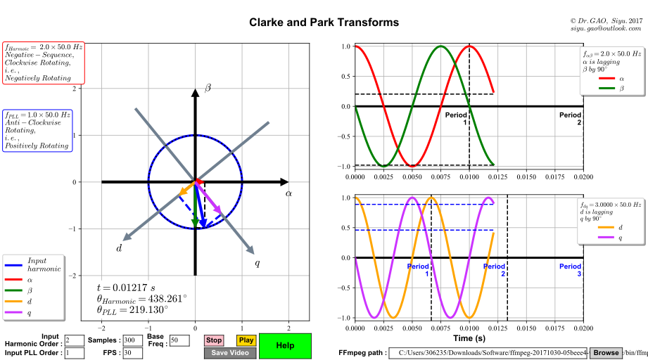

Introduction
=============
    The purpose of this project is to dynamically visualise the Clarke Transform 
    and the Park Transform (animation). 
    
    A much heavier project to dynamically visualise the symmetrical components of 
    three-phase inputs (:math:`a_{\pm}, b_{\pm}, c_{\pm}, Zero`), the Clarke Transform
    (:math:`\alpha_{\pm}, \beta_{\pm}, Zero`) and the Park Transform 
    (:math:`d_{\pm}, q_{\pm}, Zero`) is on the way.

Three-Phase Inputs
----------------------------------------
.. math::
	\omega = 2 \pi f

.. math::
	\left[\begin{matrix} a \\ b \\ c \end{matrix}\right] = \left[\begin{matrix} \cos(n \cdot \omega t) \\ \cos[n \cdot (\omega t - \frac{2}{3} \pi)] \\ \cos[n \cdot (\omega t + \frac{2}{3} \pi)] \end{matrix}\right]

.. math::
	where, n \geqslant 0

.. note::
    |  :math:`f` is the system's base frequency.
    |  :math:`\omega` is the corresponding angular velocity.
    |  :math:`n` is the harmonic order.
    |  :math:`t` is the time.
    |  
    |  When :math:`n = 0 + 3k, k = 0, 1, 2, 3, \cdots ,` the three-phase inputs are said to be the **Zero Sequences**.
    |  
    |  When :math:`n = 1 + 3k, k = 0, 1, 2, 3, \cdots ,` the three-phase inputs are said to be the **Positive Sequences**.
    |  
    |  When :math:`n = 2 + 3k, k = 0, 1, 2, 3, \cdots ,` the three-phase inputs are said to be the **Negative Sequences**.
    

Clarke Transform (amplitude invariant)
----------------------------------------
.. math::
	\left[\begin{matrix} \alpha \\ \beta \\ Zero \end{matrix}\right] = \frac{2}{3} \left[\begin{matrix} 1 & -\frac{1}{2} & -\frac{1}{2} \\ 0 & \frac{\sqrt{3}}{2} & -\frac{\sqrt{3}}{2} \\ \frac{1}{2} & \frac{1}{2} & \frac{1}{2} \end{matrix}\right] \left[\begin{matrix} a \\ b \\ c \end{matrix}\right]
    
.. note::
    |  For **Zero Sequences** :math:`\alpha` and :math:`\beta` components are zero.
    |  For **Positive Sequences** :math:`\alpha` **leads** :math:`\beta` by :math:`90^{\circ}`.
    |  For **Negative Sequences** :math:`\alpha` **lags** :math:`\beta` by :math:`90^{\circ}`.
    |
    |  The Clarke Transform does not alter the frequency. I.e., if the three-phase input frequency is 50 Hz, the frequencies of the Clarke components would still be 50 Hz.
    |  
    |  Interharmonics are not of any sequence because they are not evenly space by :math:`120^{\circ}`.
    

Park Transform
----------------------------------------
.. math::
	\left[\begin{matrix} d \\ q \\ Zero \end{matrix}\right] = \left[\begin{matrix} \cos\theta & \sin\theta & 0 \\ -\sin\theta & \cos\theta & 0 \\ 0 & 0 & 1 \end{matrix}\right] \left[\begin{matrix} \alpha \\ \beta \\ Zero \end{matrix}\right]
	
.. note::
    |  For **Zero Sequences** :math:`d` and :math:`q` components are zero.
    |  For **Positive Sequences** :math:`d` **leads** :math:`q` by :math:`90^{\circ}`.
    |  For **Negative Sequences** :math:`d` **lags** :math:`q` by :math:`90^{\circ}`.
    |  
    |  The Park Transform does not alter the phase difference between the components. I.e., if :math:`\alpha` leads :math:`\beta`, then :math:`d` would still lead :math:`q`.
    |  However, the Park Transform changes the frequencies. This change is related to the **sequence** of the three-phase inputs. 
    |  
    |  For **Positive Sequences**, the frequencies of the :math:`d` and :math:`q` components would be reduced by 1 order of the base frequency. 
    |  
    |  For **Negative Sequences**, the frequencies of the :math:`d` and :math:`q` components would be increased by 1 order of the base frequency. 
    |  
    
      Examples :
        |  The :math:`d` and :math:`q` components of the 1st order harmonic (the fundamental, Positive Sequences) would be DC components :
        |  
        |  :math:`f_{Park} = (+1 - 1) \cdot f_{base} = 0`
        |
        |  where :math:`+1` means (**Positive Sequence** and once the base frequency).
        |  
        |  The :math:`d` and :math:`q` components of the 2nd order harmonic (Negative Sequences) would 3 times the base frequency : 
        |
        |  :math:`f_{Park} = (-2 - 1) \cdot f_{base} = -3 \cdot f_{base}`
        |
        |  where ":math:`-2`" means (**Negative Sequence** and twice the base frequency) 
           and ":math:`-3`" means :math:`d` lags :math:`q` and the frequency of the 
           Park components is 3 times the base frequency.

|  

User Interface
----------------------------------------

|  

List of User Configurations (input fields)
^^^^^^^^^^^^^^^^^^^^^^^^^^^^^^^^^^^^^^^^^^^
    It is recommended to stop the animation before making changes to the input fields. 
    Otherwise the UI may not register the focus.

|  **Input Harmonic Oder :**
|    The order of harmonic to be analysed. Should be a positive read number (unsigned float)		.
|
|  **Input PLL Oder :**
|    The order of the PLL. Positive number means anti-clockwise rotation. Negative number means clockwise rotation. The value of the number means how many times the base frequency the PLL frequency is. Should be a real number (signed float).
|
|  **Samples :** 
|	 The number of samples to be taken within one base period. Should be unsigned int.
|
|  **FPS :**
|	 Only applied when saving video. NOT applied in real time. Should be unsigned int.
|
|  **Base Freq :**
|	 Base frequency of the system, i.e., 50 or 60. This can be any non-zero positive number (unsigned float, non-zero).
|
|  **FFmpeg path :**
|	 Path of the FFmpeg binary (string).
|  

.. note::
   Zero Sequences are not plotted since their :math:`\alpha, \beta, d` and :math:`q` components are zero. 
   Also, they need 3D coordinates.
   
   The input fields, the buttons and the corresponding labels are hidden in the saved videos.
   
   FFmpeg is a popular multi-media codec and it is free to download and use.
   
List of Dynamic Information
^^^^^^^^^^^^^^^^^^^^^^^^^^^^^^^^

    The following information would change dynamically with changes made to the user configurations.
    
    Note that these pieces of information would only be refreshed when the "Play" button is clicked.

|  **Information for the input harmonic :**
|    These pieces of information are displayed in the left top corner, inside the red box. 
|  
|    They include: the harmonic frequency, the sequence of the input harmonic, the rotational direction of this input harmonic.
|  
|  **Information for the PLL :**
|    These pieces of information are displayed in the left top middle corner, inside the blue box. 
|  
|    They include: frequency of the PLL and the rotational direction of the PLL.
|  
|  **Information for the Clarke Transform :**
|    These pieces of information are displayed in the right top corner. 
|    
|    They include: frequency of the Clarke components and the phase relation between them.
|  
|  **Information for the Park Transform :**
|    These pieces of information are displayed in the right middle corner. 
|  
|    They include: frequency of the Park components and the phase relation between them.
|

Demonstration
^^^^^^^^^^^^^^^^^^^^^^^^^^^^^^^^
.. raw:: html
    
    <b>This is a screen recording showing how to use:</b>
	
	 
     
	
    <video width="100%" height="100%" controls src=".\_video\screen_record.mp4" autoplay loop>
	
		Your browser does not support the video tag (HTML5).
	
	</video>
	
|  

Examples of saved videos
^^^^^^^^^^^^^^^^^^^^^^^^^^^^^^^^
.. raw:: html
    
    <b>(1) PLL locked on to the fundamental while the input is the fundamental</b>
	
	 
	 
    
    <video width="100%" height="100%" controls src=".\_video\demo1.mp4" autoplay loop>
	
		Your browser does not support the video tag (HTML5).
	
	</video>
    
     
	 
    
    <b>(2) PLL locked on to the fundamental while the input is the 2nd harmonic</b>
    
    <video width="100%" height="100%" controls src=".\_video\demo2.mp4" autoplay loop>
	
		Your browser does not support the video tag (HTML5).
	
	</video>
    
     
	 
    
    <b>(3) PLL locked on to the fundamental while the input is the 1.3 times harmonic (interharmonic)</b>
    
    <video width="100%" height="100%" controls src=".\_video\demo3.mp4" autoplay loop>
	
		Your browser does not support the video tag (HTML5).
	
	</video>
